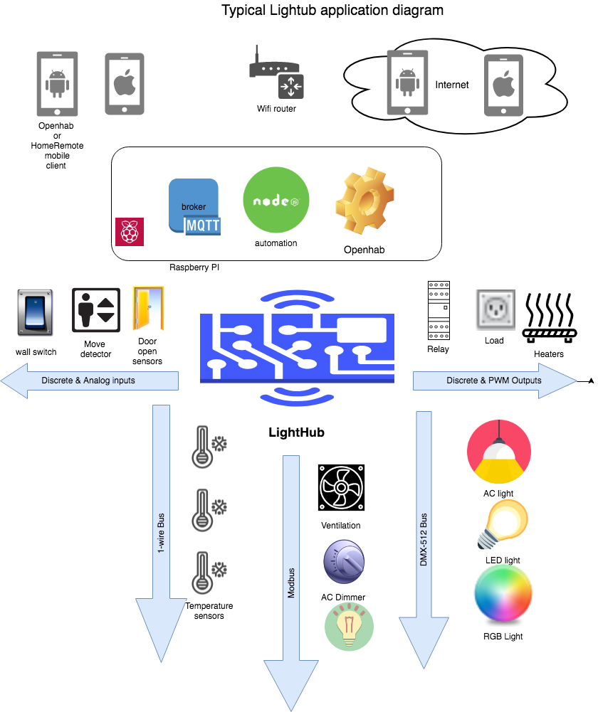

# LightHub
is Flexible, Arduino-Mega/Arduino DUE/ESP8266/ESP32 open-software and open-hardware SmartHome controller. [RU](https://geektimes.ru/post/295109/) [HOME-site RU](http://lazyhome.ru)
It may operate both: 
* On [especially designed hardware board](http://www.lazyhome.ru/index.php/featurerequest) with 16 optocoupled digital inputs, 16 ESD protected digital/analog Inputs/outputs, 8 open-collector outputs (up to 0.5A/50V), DMX IN/OUT, MODBUS RTU and hardware 1-wire support circuit.
* On plain Arduino MEGA 2560, Arduino DUE, ESP8266, ESP32 and even on [Controllino](http://controllino.biz/)
(Controllino is not tested enough)

Lighthub allows connecting together:
* Contact sensors (switches, buttons etc)
* Analog sensors (Leak detectors, Knobs etc)
* 1-Wire temperature sensors (up to 20 on single bus)
* Temperature/Humidity/CO2 sensors: DHT22, CS811, HDC1080
* Standard nonexpensive Relay board with TTL inputs, [like this](http://ali.pub/2zlosh) to control AC powered lamps, floor heaters, boilers etc
* [Standard nonexpensive LED dimmers](http://ali.pub/2zlokp) and [AC DMX-512 dimmers](http://ali.pub/2zlont)
* Modbus RTU devices (Currently, are deployed two types of Modbus devices: AC Dimmer and Ventilation set (Based on [Vacon 10 controller](http://files.danfoss.com/download/Drives/Vacon-10-Quick-Guide-DPD00714F1-UK.pdf))
* Simple DMX wall sensor panel [like this](http://ali.pub/2zlohe)

[List of non-expensive compatible components from AliExpress here](http://ppv.alipromo.com/custom/promo.php?hash=pjagwaovaero6vkeabjpkpvy4gznbgkc&landing_id=39661)

Where is possible both, to configure local control/mapping between inputs and outputs (light, floor heating thermostats) and remote control from MQTT enabled software. At the moment, LightHub tested and perfectly working with following set of complementary free software:
* [Openhab or Openhab2 Smarthome software](http://www.openhab.org/)
Openhab provides own native mobile app both, for IoS and Android, and even allow you to use Apple's HomeKit and Google Home to say "Siri, turn on light in bedroom" or "Hey Google, set bedroom light to Red" but requires some server to be installed in-premises (Raspberry PI with [Openhabian](https://docs.openhab.org/installation/openhabian) will good enough)
* [HomeRemote mobile client](http://thehomeremote.com/)
Home Remote mobile applicatios for IoS and Android requires just MQTT broker to be working. Any Cloud-based MQTT broker, like [CloudMQTT](https://www.cloudmqtt.com/) will enough to serve average household, even with free account. 
* [Node-Red](https://nodered.org/)  Possibly, the best solution to deploy event-based authomation and scripting on top of MQTT/LightHub. The easy to use universal and visual tool to wire many different devices in single system. Having own Dashbord which allow control from web/mobile web, even without mobile apps (excelent co-working with OpenHab and HomeRemote)

Scalability of Lighthub is virtually unlimited: Setup so many controllers you needed in most convenient places of your house - MQTT broker will allow controllers communicate each other and with Openhab/NodeRed/HomeRemote and propagate commands across network.

# [Please refer to our Wiki for insructions.](https://github.com/anklimov/lighthub/wiki/Configuring)
* [Compiling and flashing](https://github.com/anklimov/lighthub/wiki/Compiling-and-flashing)
* [Configuring](https://github.com/anklimov/lighthub/wiki/Configuring)
* [Channel commands](https://github.com/anklimov/lighthub/wiki/Channel-commands)
* [OpenHab integration](https://github.com/anklimov/lighthub/wiki/OpenHab--integration)

# Platforms specific details:

**AVR** version (Arduino Mega) is basic, long time in production and have all functions
* DMX-out is software (DMXSimple) on pin3, can be re-defined to PIN 18 (USART1 TX)
* DMX-in - hardware
* WIZNET 5100 and 5500 Ethernets are supported
* Modbus on USART2

**SAM3X8E** (Arduino DUE): (Tested. In production. Recomended hardware at current moment)
* default PWM out frequency
* both, DMX-in and DMX-out are hardware USART based. Use USART1 (pins 18 and 19) for DMX-out and DMX-in
* WIZNET 5100 and 5500 Ethernets are supported
* Modbus on USART2

**ESP8266, ESP32**: (Tested)
* DMX-OUT on USART1 TX
* DMX-IN - disabled - not possible to deploy in ESP8266
* Modbus - disabled. Might be configured in future on USART0 instead CLI/DEBUG
* Uses Wifi interface instead wired connection

**NRF52840** : Still early development stage

# Custom build flags

* MY_CONFIG_SERVER=192.168.1.1 // address of external JSON-config http://192.168.1.1/de-ad-be-ef-fe-00.config.json
* WATCH_DOG_TICKER_DISABLE //disable wdt feature
* USE_1W_PIN=49 // use direct connection to 1W devices on 49 pin, no I2C bridge DS2482-100
* SD_CARD_INSERTED // enable sd-card support and fix lan starting
* SERIAL_BAUD=115200 // set baud rate for console on Serial0
* Wiz5500 //Use Wiznet 5500 library instead Wiznet 5100
* DISABLE_FREERAM_PRINT // disable printing free Ram in bytes
* CUSTOM_FIRMWARE_MAC=de:ad:be:ef:fe:00 //set firmware macaddress
* DMX_DISABLE //disable DMX support
* MODBUS_DISABLE // disable Modbus support
* OWIRE_DISABLE // disable OneWire support
* ARTNET_ENABLE //Enable Artnet protocol support
* AVR_DMXOUT_PIN=18 // Set Pin for DMXOUT on megaatmega2560
* CONTROLLINO //Change Modbus port, direction pins and Wiznet SS pins to be working on [Controllino](http://controllino.biz/)
* LAN_INIT_DELAY=2000 // set lan init delay for Wiznet ethernet shield
* ESP_WIFI_AP=MYAP // esp wifi access point name
* ESP_WIFI_PWD=MYPWD // esp wifi access point password
* WIFI_MANAGER_DISABLE //Disable wifi manager for esp8266
* COUNTER_DISABLE //disable Counter, Uptime input support (for RAM savings on mega2560)
* DHT_DISABLE //disable DHT input support (for RAM savings on mega2560)
* RESTART_LAN_ON_MQTT_ERRORS //reinit LAN if many mqtt errors occured
* DEVICE_NAME short handy device name which is used instead of mac for download config http://{MY_CONFIG_SERVER}/{DEVICE_NAME}_config.json
* SYSLOG_ENABLE enable UDP SYSLOG support feature(under DEVELOPMENT) that must be configured through config file
* WITH_PRINTEX_LIB use PrintEx library (develop experimental feature)
* CSSHDC_DISABLE //Disable CS811 and HDC1080 sensors support

# Default compilation behavior:
* Config server: lazyhome.ru (hosting of config files available for all registred users of portal - see MyDevices tab)
* Watchdog enabled
* 1-Wire communication with DS2482-100 I2C driver
* No SD
* Serial speed 115200
* Wiznet 5100 (for MEGA & DUE)
* Free Ram printing enabled
* de:ad:be:ef:fe:ff default MAC address for MEGA (on ESPx, DUE - using hardware defined MAC by default) 
* DMX support enabled
* Modbus support enabled
* OneWire support enabled
* Artnet disabled
* LAN_INIT_DELAY=500 //ms
* Defailt MQTT broadcast input topic: myhome/in
* Default MQTT topic to publish device status: myhome/s_out
* Default Alarm output topic: alarm
* DHT, Counter, Uptime support enabled
* Wifi manager for esp8266/esp32 enabled
* RESTART_LAN_ON_MQTT_ERRORS disabled
* DEVICE_NAME disabled
* SYSLOG_ENABLE disabled
* WITH_PRINTEX_LIB disabled, using Streaming library
* CS811 and HDC1080 sensors support are enabled

