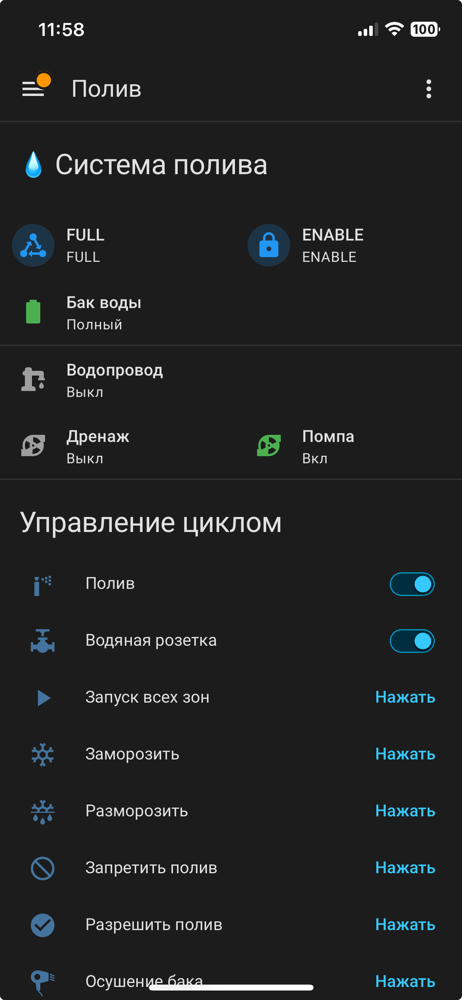
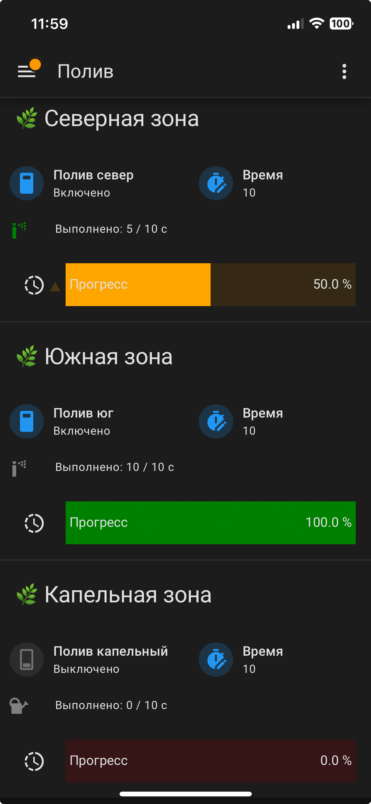

# Исчерпывающее руководство по настройке системы полива в Home Assistant

Это руководство шаг за шагом проведёт вас через установку и настройку многоканальной системы полива на базе [lighthub](https://github.com/anklimov/lighthub), интегрированной с Home Assistant через MQTT. В результате вы получите красивую и функциональную панель управления, которая включает:

- визуализацию уровня воды в баке (пусто / наполовину / полный),
- индикацию работы водопровода, дренажного и основного насосов,
- управление тремя зонами полива с заданием времени и прогресс-баром,
- интерактивную корректировку выполненного времени через проценты,
- историю ключевых параметров по клику на иконки.

---

## 1. Предварительные требования

- Установленный и настроенный [Home Assistant](https://www.home-assistant.io/) (любая версия, поддерживающая Lovelace).
- Настроенный MQTT-брокер (например, Mosquitto) и интеграция MQTT в Home Assistant.
- [HACS](https://hacs.xyz/) (Home Assistant Community Store) – для установки кастомных карт.

> **Примечание:** Конфигурация MQTT‑датчиков и устройств уже готова и будет приведена ниже. Предполагается, что ваш контроллер lighthub уже отправляет данные в соответствующие топики.

---

## 2. Установка кастомных карт через HACS

Для корректной работы панели необходимо установить следующие карты. Все они доступны в HACS.

1. Откройте **HACS** → **Frontend** → **Explore & Download Repositories**.
2. Поочерёдно найдите и установите каждую из перечисленных ниже карт.
3. После установки **обновите страницу** браузера (или перезагрузите интерфейс Home Assistant).

### Список обязательных карт

| Название                     | Репозиторий (для ручного добавления, если не находится) | Назначение |
|------------------------------|----------------------------------------------------------|------------|
| **Vertical Stack In Card**   | `ofekashery/vertical-stack-in-card`                      | Объединение нескольких карточек в одну с общим фоном |
| **Button Card**              | `custom-cards/button-card`                               | Гибкая карточка с динамическими иконками, анимацией и состояниями |
| **Bar Card**                 | `spacerokk/bar-card` (активный форк)                     | Прогресс-бар для отображения выполнения полива |
| **Mushroom Cards**           | `piitaya/lovelace-mushroom`                              | Компактные и стильные карточки для датчиков и переключателей |
| **Slider Entity Row**        | `thomasloven/lovelace-slider-entity-row`                | Ползунок для настройки времени в more‑info окнах (не обязателен, но используется в стандартном окне `number`) |
| **Card Mod**                 | `thomasloven/lovelace-card-mod`                         | Позволяет добавлять произвольные CSS‑стили к карточкам |

> **Важно:** Если какая‑то карта не отображается в HACS, добавьте её вручную через **HACS → ⋮ → Пользовательские репозитории**. В поле URL вставьте ссылку на GitHub‑репозиторий, категорию выберите **Lovelace**.

---

## 3. Настройка MQTT‑сущностей

Вся логика обмена данными с контроллером lighthub заложена в MQTT‑конфигурации. Скопируйте приведённый ниже блок в файл `configuration.yaml` (или в отдельный файл, подключённый через `mqtt: !include mqtt.yaml`).

```yaml
# Пример размещения в configuration.yaml
mqtt:
  switch:
    - name: "Полив"
      state_topic:  "edem/s_out/sprinkler/cmd"
      command_topic: "edem/air/sprinkler/cmd"
      availability_topic: "edem/air/$state"
      payload_available: "ready"
      payload_not_available: "disconnected"

    - name: "Полив север"
      state_topic:  "edem/s_out/sprinkler/nord/cmd"
      command_topic: "edem/air/sprinkler/nord/cmd"
      availability_topic: "edem/air/$state"
      payload_available: "ready"
      payload_not_available: "disconnected"

    - name: "Полив юг"
      state_topic:  "edem/s_out/sprinkler/south/cmd"
      command_topic: "edem/air/sprinkler/south/cmd"
      availability_topic: "edem/air/$state"
      payload_available: "ready"
      payload_not_available: "disconnected"

    - name: "Полив капельный"
      state_topic:  "edem/s_out/sprinkler/trees/cmd"
      command_topic: "edem/air/sprinkler/trees/cmd"
      availability_topic: "edem/air/$state"
      payload_available: "ready"
      payload_not_available: "disconnected"

    - name: "Полив розетки"
      state_topic:  "edem/s_out/sprinkler/outlets/cmd"
      command_topic: "edem/air/sprinkler/outlets/cmd"
      availability_topic: "edem/air/$state"
      payload_available: "ready"
      payload_not_available: "disconnected"

  button:
    - name: "Полив сброс"
      command_topic: "edem/air/sprinkler/cmd"
      payload_press: "RESET"
      availability_topic: "edem/air/$state"
      payload_available: "ready"
      payload_not_available: "disconnected"

    - name: "Полив блокировка"
      command_topic: "edem/air/sprinkler/cmd"
      payload_press: "FREEZE"
      availability_topic: "edem/air/$state"
      payload_available: "ready"
      payload_not_available: "disconnected"

    - name: "Полив разблокировка"
      command_topic: "edem/air/sprinkler/cmd"
      payload_press: "UNFREEZE"
      availability_topic: "edem/air/$state"
      payload_available: "ready"
      payload_not_available: "disconnected"

    - name: "Полив разрешить"
      command_topic: "edem/air/sprinkler/cmd"
      payload_press: "ENABLE"
      availability_topic: "edem/air/$state"
      payload_available: "ready"
      payload_not_available: "disconnected"

    - name: "Полив запретить"
      command_topic: "edem/air/sprinkler/cmd"
      payload_press: "DISABLE"
      availability_topic: "edem/air/$state"
      payload_available: "ready"
      payload_not_available: "disconnected"

    - name: "Полив осушение бака"
      command_topic: "edem/air/sprinkler/cmd"
      payload_press: "DRY"
      availability_topic: "edem/air/$state"
      payload_available: "ready"
      payload_not_available: "disconnected"

  number:
    - name: "Полив юг"
      state_topic:  "edem/s_out/sprinkler/south/set"
      command_topic: "edem/air/sprinkler/south/set"
      min: 0
      max: 6000
      availability_topic: "edem/air/$state"
      payload_available: "ready"
      payload_not_available: "disconnected"

    - name: "Полив север"
      state_topic:  "edem/s_out/sprinkler/nord/set"
      command_topic: "edem/air/sprinkler/nord/set"
      min: 0
      max: 6000
      availability_topic: "edem/air/$state"
      payload_available: "ready"
      payload_not_available: "disconnected"

    - name: "Полив капельный"
      state_topic:  "edem/s_out/sprinkler/trees/set"
      command_topic: "edem/air/sprinkler/trees/set"
      min: 0
      max: 6000
      availability_topic: "edem/air/$state"
      payload_available: "ready"
      payload_not_available: "disconnected"

    - name: "Полив юг выполнено"
      state_topic:  "edem/s_out/sprinkler/south/val"
      command_topic: "edem/air/sprinkler/south/val"
      min: 0
      max: 60000
      mode: slider
      icon: "mdi:timer-sand"
      unit_of_measurement: 'sec'
      availability_topic: "edem/air/$state"
      payload_available: "ready"
      payload_not_available: "disconnected"

    - name: "Полив север выполнено"
      state_topic:  "edem/s_out/sprinkler/nord/val"
      command_topic: "edem/air/sprinkler/nord/val"
      min: 0
      max: 60000
      mode: slider
      icon: "mdi:timer-sand"
      unit_of_measurement: 'sec'
      availability_topic: "edem/air/$state"
      payload_available: "ready"
      payload_not_available: "disconnected"

    - name: "Полив капельный выполнено"
      state_topic:  "edem/s_out/sprinkler/trees/val"
      command_topic: "edem/air/sprinkler/trees/val"
      min: 0
      max: 60000
      mode: slider
      icon: "mdi:timer-sand"
      unit_of_measurement: 'sec'
      availability_topic: "edem/air/$state"
      payload_available: "ready"
      payload_not_available: "disconnected"

  sensor:
    - name: "Полив бак Макс"
      state_topic:  "edem/s_out/sprinkler/$wMax"
      availability_topic: "edem/air/$state"
      payload_available: "ready"
      payload_not_available: "disconnected"

    - name: "Полив бак Мin"
      state_topic:  "edem/s_out/sprinkler/$wMin"
      availability_topic: "edem/air/$state"
      payload_available: "ready"
      payload_not_available: "disconnected"

    - name: "Полив водопровод"
      state_topic:  "edem/s_out/sprinkler/$vIN"
      availability_topic: "edem/air/$state"
      payload_available: "ready"
      payload_not_available: "disconnected"

    - name: "Полив дренаж вкл"
      state_topic:  "edem/s_out/sprinkler/$rDren"
      availability_topic: "edem/air/$state"
      payload_available: "ready"
      payload_not_available: "disconnected"

    - name: "Полив дренаж качает"
      state_topic:  "edem/s_out/sprinkler/$fbDren"
      availability_topic: "edem/air/$state"
      payload_available: "ready"
      payload_not_available: "disconnected"

    - name: "Полив насос вкл"
      state_topic:  "edem/s_out/sprinkler/$rPump"
      availability_topic: "edem/air/$state"
      payload_available: "ready"
      payload_not_available: "disconnected"

    - name: "Полив насос качает"
      state_topic:  "edem/s_out/sprinkler/$fbPump"
      availability_topic: "edem/air/$state"
      payload_available: "ready"
      payload_not_available: "disconnected"

    - name: "Полив состояние"
      state_topic:  "edem/s_out/sprinkler/$state"
      availability_topic: "edem/air/$state"
      payload_available: "ready"
      payload_not_available: "disconnected"

    - name: "Полив ошибка"
      state_topic:  "edem/s_out/sprinkler/$fault"
      availability_topic: "edem/air/$state"
      payload_available: "ready"
      payload_not_available: "disconnected"

    - name: "Поливаем юг"
      state_topic:  "edem/s_out/sprinkler/south/$state"
      availability_topic: "edem/air/$state"
      payload_available: "ready"
      payload_not_available: "disconnected"

    - name: "Поливаем север"
      state_topic:  "edem/s_out/sprinkler/nord/$state"
      availability_topic: "edem/air/$state"
      payload_available: "ready"
      payload_not_available: "disconnected"

    - name: "Поливаем капельно"
      state_topic:  "edem/s_out/sprinkler/trees/$state"
      availability_topic: "edem/air/$state"
      payload_available: "ready"
      payload_not_available: "disconnected"

    - name: "Полив розетка статус"
      state_topic:  "edem/s_out/sprinkler/outlets/$state"
      availability_topic: "edem/air/$state"
      payload_available: "ready"
      payload_not_available: "disconnected"

    - name: "Полив блокировки"
      state_topic:  "edem/s_out/sprinkler/ctrl"
      availability_topic: "edem/air/$state"
      payload_available: "ready"
      payload_not_available: "disconnected"
```

> **Пояснение:**  
> - `switch` – переключатели для запуска/остановки зон и общий переключатель.  
> - `button` – кнопки для сброса, блокировки, разрешения и осушения бака.  
> - `number` – задание времени полива (уставки) и выполненное время (с возможностью ручной корректировки).  
> - `sensor` – датчики состояния поплавков (`$wMax`, `$wMin`), водопровода, насосов, статуса полива, ошибок и т.д.

После добавления конфигурации **перезагрузите YAML** (Настройки → Сервер → Перезагрузить конфигурацию YAML).

---

## 4. Настройка template‑сущностей

Для работы панели необходимы два типа вычислимых объектов:

- **Уровень бака в процентах** (на основе поплавков).  
- **Прогресс полива в процентах** для каждой зоны (с возможностью двусторонней синхронизации: проценты ↔ секунды).

Добавьте следующий блок в `configuration.yaml` (если у вас уже есть секция `template:`, объедините её с этим содержимым, сохранив правильные отступы):

```yaml
template:
  # Сенсор уровня бака
  - sensor:
      - name: "Полив бак уровень"
        state: >
          
            100
          
            50
          
            0
          

  # Числовые шаблоны прогресса (проценты)
  - number:
      - name: "Полив юг прогресс"
        state: >
          
          
          {{ ((vypolneno / zadanie * 100) | round(0)) if zadanie > 0 else 0 }}
        set_value:
          - service: number.set_value
            target:
              entity_id: number.poliv_iug_vypolneno
            data:
              value: >
                
                {{ ((value | float(0)) * zadanie / 100) | round(0) }}
        min: 0
        max: 100
        step: 1
        unit_of_measurement: "%"
        icon: mdi:progress-clock

      - name: "Полив север прогресс"
        state: >
          
          
          {{ ((vypolneno / zadanie * 100) | round(0)) if zadanie > 0 else 0 }}
        set_value:
          - service: number.set_value
            target:
              entity_id: number.poliv_sever_vypolneno
            data:
              value: >
                
                {{ ((value | float(0)) * zadanie / 100) | round(0) }}
        min: 0
        max: 100
        step: 1
        unit_of_measurement: "%"
        icon: mdi:progress-clock

      - name: "Полив капельный прогресс"
        state: >
          
          
          {{ ((vypolneno / zadanie * 100) | round(0)) if zadanie > 0 else 0 }}
        set_value:
          - service: number.set_value
            target:
              entity_id: number.poliv_kapelnyi_vypolneno
            data:
              value: >
                
                {{ ((value | float(0)) * zadanie / 100) | round(0) }}
        min: 0
        max: 100
        step: 1
        unit_of_measurement: "%"
        icon: mdi:progress-clock
```

**Как это работает:**  
- `state` динамически вычисляет процент выполнения на основе заданного времени (`number.poliv_...`) и выполненного (`number.poliv_..._vypolneno`).  
- `set_value` при ручном изменении процента (через ползунок или ввод) пересчитывает его в секунды и отправляет команду в контроллер через `number.set_value` для выполненного времени. Таким образом, можно вручную скорректировать прогресс, и значение сразу уйдёт в MQTT.  
- Бак определяется по поплавкам: если активен `$wMax` → 100%, если только `$wMin` → 50%, иначе 0%.

Снова **перезагрузите YAML‑конфигурацию**.

---

## 5. Создание панели управления (Dashboard)

### 5.1. Создание новой панели

1. Перейдите в **Настройки** → **Панели** (Dashboards).
2. Нажмите **Создать панель** (Add Dashboard).
   - Название: `💧 Полив`
   - Режим панели: **Панель (одна карточка)** – *Panel (1 card)*.
3. Нажмите **Создать**.

### 5.2. Переход в редактор YAML

Сразу после создания панель откроется в графическом редакторе.  
Нажмите на три точки **⋮** в правом верхнем углу и выберите **Редактор YAML**.

### 5.3. Вставка финального YAML

Удалите всё содержимое (обычно там `type: panel\npath: ""\ncards: []`) и вставьте следующий код:

```yaml
views:
  - type: panel
    path: ''
    cards:
      - type: custom:vertical-stack-in-card
        title: 💧 Система полива
        cards:
          # ── Общее состояние ──
          - type: horizontal-stack
            cards:
              - type: custom:mushroom-entity-card
                entity: sensor.poliv_sostoianie
                name: Статус
                primary_info: state
                icon: mdi:state-machine
              - type: custom:mushroom-entity-card
                entity: sensor.poliv_blokirovki
                name: Режим
                primary_info: state
                icon: mdi:lock

          # ── Бак ──
          - type: custom:mushroom-template-card
            primary: Бак воды
            secondary: |
              
               Полный
               Наполовину
               Пустой 
            icon: mdi:battery
            icon_color: |
              
               green
               orange
               grey 
            tap_action:
              action: more-info
              entity: sensor.poliv_bak_uroven
            card_mod:
              style: |
                ha-card {
                  --mush-icon-size: 24px;
                  height: 60px;
                }

          - type: divider

          # ── Водопровод ──
          - type: custom:mushroom-template-card
            primary: Водопровод
            secondary: |
               Вкл
               Выкл 
            icon: mdi:water-pump
            icon_color: |
               blue
               grey 
            tap_action:
              action: more-info
              entity: sensor.poliv_vodoprovod
            card_mod:
              style: |
                ha-card {
                  --mush-icon-size: 24px;
                  height: 60px;
                }

          # ── Насосы ──
          - type: horizontal-stack
            cards:
              - type: custom:mushroom-template-card
                primary: Дренаж
                secondary: |
                  
                  
                   Качает
                   Вкл
                   Выкл 
                icon: mdi:pump
                icon_color: |
                  
                  
                   red
                   green
                   grey 
                tap_action:
                  action: more-info
                  entity: sensor.poliv_drenazh_kachaet
                card_mod:
                  style: |
                    ha-card {
                      --mush-icon-size: 24px;
                      height: 65px;
                    }

              - type: custom:mushroom-template-card
                primary: Помпа
                secondary: |
                  
                  
                   Качает
                   Вкл
                   Выкл 
                icon: mdi:pump
                icon_color: |
                  
                  
                   red
                   green
                   grey 
                tap_action:
                  action: more-info
                  entity: sensor.poliv_nasos_kachaet
                card_mod:
                  style: |
                    ha-card {
                      --mush-icon-size: 24px;
                      height: 65px;
                    }

          - type: divider

          # ── Управление циклом ──
          - type: entities
            title: Управление циклом
            show_header_toggle: false
            entities:
              - entity: switch.poliv
                name: Полив
                icon: mdi:sprinkler
              - entity: switch.poliv_rozetki
                name: Водяная розетка
                icon: mdi:pipe-valve
              - entity: button.poliv_sbros
                name: Запуск всех зон
                icon: mdi:play
              - entity: button.poliv_blokirovka
                name: Заморозить
                icon: mdi:snowflake
              - entity: button.poliv_razblokirovka
                name: Разморозить
                icon: mdi:snowflake-melt
              - entity: button.poliv_zapretit
                name: Запретить полив
                icon: mdi:cancel
              - entity: button.poliv_razreshit
                name: Разрешить полив
                icon: mdi:check-circle
              - entity: button.poliv_osushenie_baka
                name: Осушение бака
                icon: mdi:hair-dryer

          - type: divider

          # ── Северная зона ──
          - type: custom:vertical-stack-in-card
            title: 🌿 Северная зона
            cards:
              - type: horizontal-stack
                cards:
                  # Выключатель
                  - type: custom:mushroom-entity-card
                    entity: switch.poliv_sever
                    show_name: false
                    show_icon: false
                    show_state: false
                    layout: horizontal
                  # Время
                  - type: custom:mushroom-entity-card
                    entity: number.poliv_sever
                    name: Время
                    icon: mdi:timer-edit
                    layout: horizontal
                    card_mod:
                      style: |
                        ha-card {
                          --mush-icon-size: 24px;
                          height: 48px;
                          flex: 1 1 0;
                        }
              - type: conditional
                conditions:
                  - entity: number.poliv_sever
                    state_not: '0'
                card:
                  type: custom:vertical-stack-in-card
                  title: ''
                  cards:
                    - type: horizontal-stack
                      cards:
                        - type: custom:button-card
                          entity: sensor.polivaem_sever
                          show_name: false
                          show_state: false
                          icon: mdi:sprinkler
                          tap_action:
                            action: more-info
                            entity: sensor.polivaem_sever
                          state:
                            - value: 'ON'
                              color: green
                              styles:
                                icon:
                                  - animation: pulse 1.5s infinite
                            - value: 'OFF'
                              color: grey
                              styles:
                                icon:
                                  - animation: none
                          styles:
                            card:
                              - height: 40px
                              - width: 40px
                            icon:
                              - width: 24px
                              - height: 24px
                        - type: custom:mushroom-template-card
                          primary: ''
                          secondary: >
                            Выполнено: {{ states('number.poliv_sever_vypolneno')
                            }} / {{ states('number.poliv_sever') }} с
                          icon: ''
                          tap_action:
                            action: more-info
                            entity: number.poliv_sever_progress
                          card_mod:
                            style: |
                              ha-card {
                                height: 40px;
                                margin-top: 0px;
                              }
                    - type: custom:bar-card
                      entities:
                        - entity: number.poliv_sever_progress
                          name: Прогресс
                          icon: mdi:progress-clock
                          max: 100
                          severity:
                            - from: 0
                              to: 25
                              color: red
                            - from: 26
                              to: 75
                              color: orange
                            - from: 76
                              to: 100
                              color: green
                          unit_of_measurement: '%'

          - type: divider

          # ── Южная зона ──
          - type: custom:vertical-stack-in-card
            title: 🌿 Южная зона
            cards:
              - type: horizontal-stack
                cards:
                  - type: custom:mushroom-entity-card
                    entity: switch.poliv_iug
                    show_name: false
                    show_icon: false
                    show_state: false
                    layout: horizontal
                  - type: custom:mushroom-entity-card
                    entity: number.poliv_iug
                    name: Время
                    icon: mdi:timer-edit
                    layout: horizontal
                    card_mod:
                      style: |
                        ha-card {
                          --mush-icon-size: 24px;
                          height: 48px;
                          flex: 1 1 0;
                        }
              - type: conditional
                conditions:
                  - entity: number.poliv_iug
                    state_not: '0'
                card:
                  type: custom:vertical-stack-in-card
                  title: ''
                  cards:
                    - type: horizontal-stack
                      cards:
                        - type: custom:button-card
                          entity: sensor.polivaem_iug
                          show_name: false
                          show_state: false
                          icon: mdi:sprinkler
                          tap_action:
                            action: more-info
                            entity: sensor.polivaem_iug
                          state:
                            - value: 'ON'
                              color: green
                              styles:
                                icon:
                                  - animation: pulse 1.5s infinite
                            - value: 'OFF'
                              color: grey
                              styles:
                                icon:
                                  - animation: none
                          styles:
                            card:
                              - height: 40px
                              - width: 40px
                            icon:
                              - width: 24px
                              - height: 24px
                        - type: custom:mushroom-template-card
                          primary: ''
                          secondary: >
                            Выполнено: {{ states('number.poliv_iug_vypolneno')
                            }} / {{ states('number.poliv_iug') }} с
                          icon: ''
                          tap_action:
                            action: more-info
                            entity: number.poliv_iug_progress
                          card_mod:
                            style: |
                              ha-card {
                                height: 40px;
                                margin-top: 0px;
                              }
                    - type: custom:bar-card
                      entities:
                        - entity: number.poliv_iug_progress
                          name: Прогресс
                          icon: mdi:progress-clock
                          max: 100
                          severity:
                            - from: 0
                              to: 25
                              color: red
                            - from: 26
                              to: 75
                              color: orange
                            - from: 76
                              to: 100
                              color: green
                          unit_of_measurement: '%'

          - type: divider

          # ── Капельная зона ──
          - type: custom:vertical-stack-in-card
            title: 🌿 Капельная зона
            cards:
              - type: horizontal-stack
                cards:
                  - type: custom:mushroom-entity-card
                    entity: switch.poliv_kapelnyi
                    show_name: false
                    show_icon: false
                    show_state: false
                    layout: horizontal
                  - type: custom:mushroom-entity-card
                    entity: number.poliv_kapelnyi
                    name: Время
                    icon: mdi:timer-edit
                    layout: horizontal
                    card_mod:
                      style: |
                        ha-card {
                          --mush-icon-size: 24px;
                          height: 48px;
                          flex: 1 1 0;
                        }
              - type: conditional
                conditions:
                  - entity: number.poliv_kapelnyi
                    state_not: '0'
                card:
                  type: custom:vertical-stack-in-card
                  title: ''
                  cards:
                    - type: horizontal-stack
                      cards:
                        - type: custom:button-card
                          entity: sensor.polivaem_kapelno
                          show_name: false
                          show_state: false
                          icon: mdi:watering-can
                          tap_action:
                            action: more-info
                            entity: sensor.polivaem_kapelno
                          state:
                            - value: 'ON'
                              color: green
                              styles:
                                icon:
                                  - animation: pulse 1.5s infinite
                            - value: 'OFF'
                              color: grey
                              styles:
                                icon:
                                  - animation: none
                          styles:
                            card:
                              - height: 40px
                              - width: 40px
                            icon:
                              - width: 24px
                              - height: 24px
                        - type: custom:mushroom-template-card
                          primary: ''
                          secondary: >
                            Выполнено: {{
                            states('number.poliv_kapelnyi_vypolneno') }} / {{
                            states('number.poliv_kapelnyi') }} с
                          icon: ''
                          tap_action:
                            action: more-info
                            entity: number.poliv_kapelnyi_progress
                          card_mod:
                            style: |
                              ha-card {
                                height: 40px;
                                margin-top: 0px;
                              }
                    - type: custom:bar-card
                      entities:
                        - entity: number.poliv_kapelnyi_progress
                          name: Прогресс
                          icon: mdi:progress-clock
                          max: 100
                          severity:
                            - from: 0
                              to: 25
                              color: red
                            - from: 26
                              to: 75
                              color: orange
                            - from: 76
                              to: 100
                              color: green
                          unit_of_measurement: '%'
```

Нажмите **Сохранить** – панель готова к использованию.

---

## 6. Как пользоваться панелью



- **Общее состояние:** Отображает статус системы и режим (заморозка/разрешено/запрещено). Ошибка не показывается, но иконка станет красной при неисправности.
- **Бак:** Иконка батарейки меняет цвет и текст в зависимости от уровня воды (пусто/наполовину/полный). Нажатие открывает историю уровня.
- **Водопровод и насосы:** Показывают текущий статус (Выкл/Вкл/Качает) с цветовой индикацией. Клик – история соответствующего датчика.
- **Управление циклом:** Общий переключатель «Полив», кнопки запуска всех зон, заморозки, запрета, осушения бака. Работают как обычные MQTT‑команды.
- **Зоны полива:**
  1. **Включение зоны** – крайний левый переключатель (тумблер).
  2. **Время** – поле с кнопками +/- для задания уставки полива в секундах.
  3. Если время > 0, под строкой появятся:
     - Индикатор полива (спринклер/лейка) – цветной, с анимацией пульсации при работе. Нажатие открывает историю активности зоны.
     - Строка «Выполнено: X / Y с» – абсолютное значение. Нажатие открывает окно редактирования прогресса в процентах.
     - Прогресс-бар – визуальное отображение процента выполнения (красный → оранжевый → зелёный).
- **Корректировка прогресса:** Кликните на строку «Выполнено…» → появится слайдер 0-100%. Измените процент, и соответствующее количество секунд сразу отправится в контроллер (автоматический пересчёт).

---

## 7. Возможные проблемы и их решение

| Проблема | Вероятная причина | Решение |
|----------|-------------------|---------|
| Не отображаются прогресс‑бары | Отсутствует `bar-card` или не созданы `template number` | Проверьте HACS, установите карту. Убедитесь, что template‑числа добавлены и конфигурация перезагружена. |
| Иконка полива не меняет цвет | Неправильное имя датчика `sensor.polivaem_...` | Проверьте точное название в разделе **Состояния**. Поправьте в YAML панели. |
| Тумблер включения зоны не видим | Не установлена карта `mushroom-entity-card` или перекрыт стилями | Убедитесь, что `mushroom-cards` установлены. В нашем финальном YAML тумблер видим всегда. |
| Ошибка «expected float» при движении слайдера прогресса | Используется `slider-entity-row` в активном режиме, а динамический `max` задан некорректно | В нашем решении прогресс‑бар только визуальный (`bar-card`), ручная корректировка – через `template number` с собственным `set_value`. Ошибки быть не должно. |
| Бак всегда показывает «Пустой» | Неправильно работают поплавки или датчики `$wMax`/`$wMin` не обновляются | Проверьте в MQTT‑топиках фактические значения. Убедитесь, что поплавки подключены и отправляют ON/OFF. |

---

## 8. Дополнительная информация

- Все команды управления (вкл/выкл зон, сброс, заморозка и т.д.) отправляются напрямую в контроллер lighthub через MQTT.
- Система использует `availability_topic` для отслеживания связи с контроллером. При пропадании сигнала все элементы станут недоступны (серые).
- При желании можно расширить панель новыми зонами, копируя структуру существующих и добавляя соответствующие `number`, `switch` и `sensor` в MQTT‑конфигурацию и `template`.

---

## Приложение: полный финальный YAML панели

Код уже приведён в разделе 5.3. Используйте его как окончательную версию.

---

Теперь ваша система полива полностью интегрирована в Home Assistant. Вы можете управлять поливом с мобильного телефона, отслеживать историю и быть уверенными, что всё под контролем!